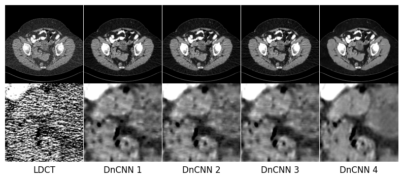
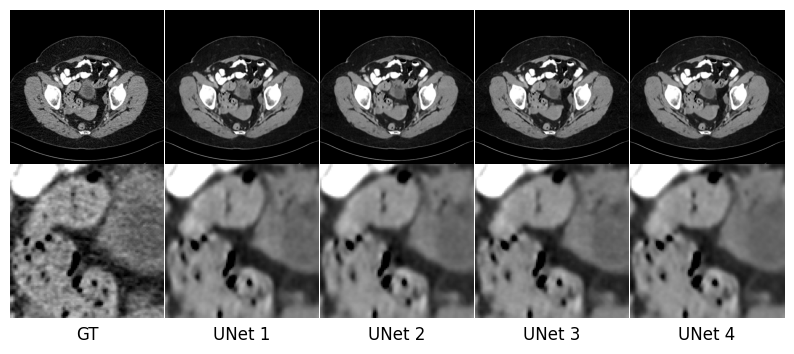

# Official Implementation for "Noise and Anatomy Adaptive Convolution for Efficient Low-Dose CT Denoising"

This project contains redesigned convolution operation implemented using OpenAI Triton.

## Key Features
*   **Modified Convolution operation using Triton**: Since it also includes reverse operations, additional learning is possible.

## Requirements
*   PyTorch (we conducted all experiments using version 2.7.0)
*   Triton (automatically installed when you install pytorch)
*   [LEAP](https://github.com/llnl/LEAP) (if using Projector)
*   [spatial-correlation-sampler](https://github.com/ClementPinard/Pytorch-Correlation-extension.git)
*   Donwload trained model files from [models](https://drive.google.com/drive/folders/1-zvAePrnsAS1sfZA7YkXu4OVtRv24fPz?usp=share_link)

## Acknowledgements
Our implementation is primarily inspired by [Fast and High Quality Image Denoising via Malleable Convolution](https://www.ecva.net/papers/eccv_2022/papers_ECCV/papers/136780420.pdf),
and uses LivermorE AI Projector for Computed Tomography (LEAP) framework to perform filtered back-projection (FBP) for reconstruction. 
We appreciate for their contributions!

